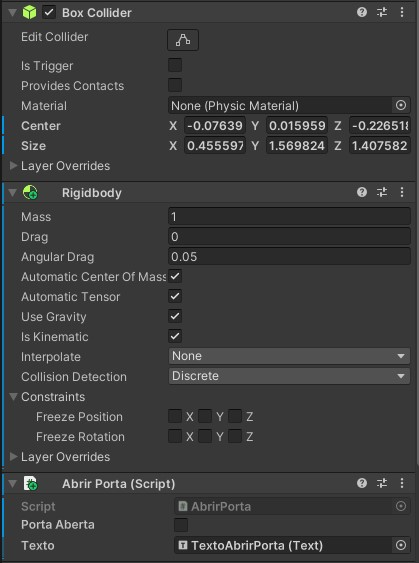
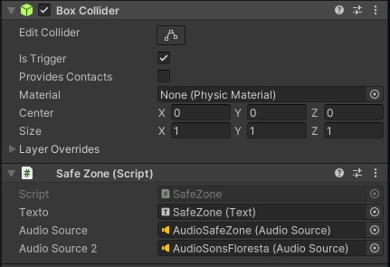
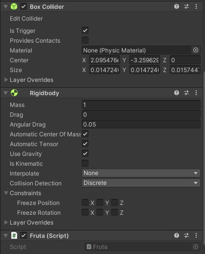
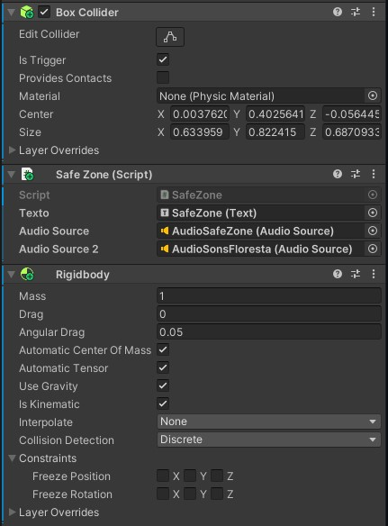
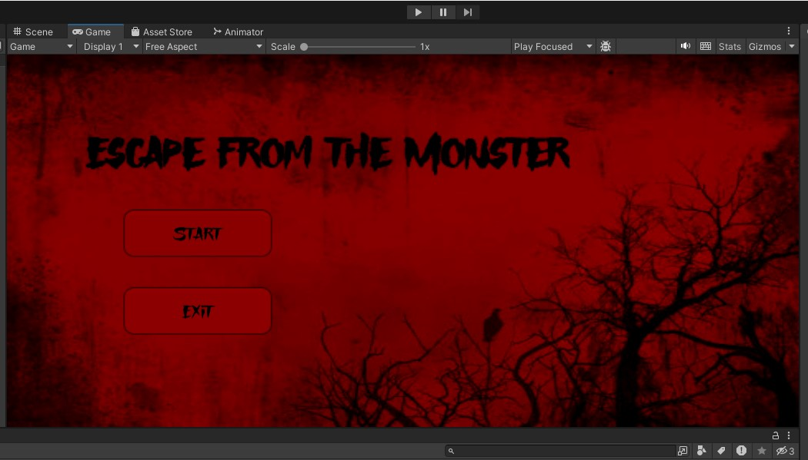
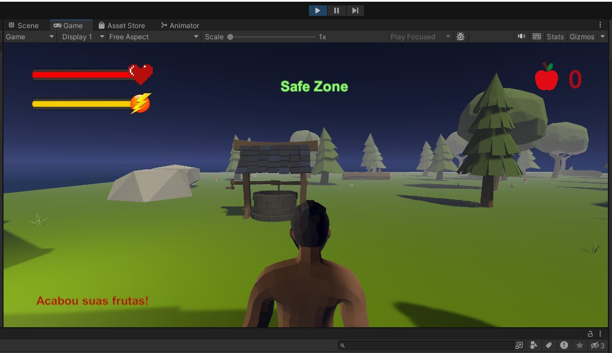
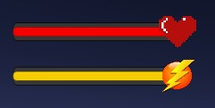
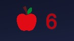
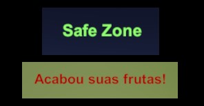
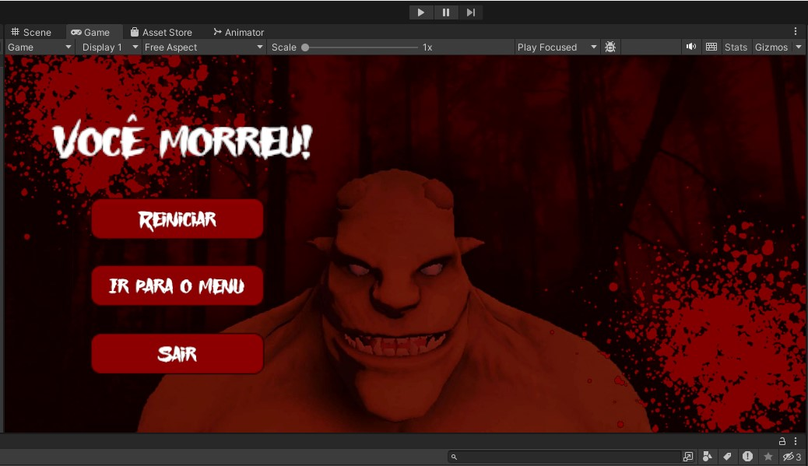

# Colisores-Unity

Cena com os tipos de colisores unity feito por Cauã Silva e Gabriel Faria 2ºJogos digitais

# Link da cena no drive
https://drive.google.com/file/d/18xF9EK3bKKlzsKSXzoRabZnKJzQHPZP1/view?usp=sharing

# Explicação da cena

A cena se passa em uma floresta a noite, onde um monstro persegue o personagem a todo momento. O personagem possui frutas que derrubam o monstro e possuem lugares na cena que são as safes zones(áreas onde o monstro não consegue atacar o personagem).

## Comandos
<ul>
    <li>W move para frente.</li>
    <li>S move para trás.</li>
    <li>A move para esquerda.</li>
    <li>D move para direita.</li>
    <li>Segurar shift junto com alguma tecla de movimento para correr.</li>
    <li>Espaço para pular.</li>
    <li>Mouse rotaciona a câmera.</li>
    <li>Botão esquerdo do mouse joga as frutas.</li>
</ul>

# Colliders

## Static collider

Um static collider é um GameObject que possui um Collider, mas não possui Rigidbody. Os static collider são usados principalmente para geometria de nível que sempre permanece no mesmo lugar e nunca se move.

Em nossa cena foram utilizados diversos statics colliders: No chão da cena, nas laterais invisiveis que ficam em volta do chão para o personagem não sair da cena(ao colidir com alguma dessas laterais o personagem sofre um efeito de recuo), nas árvores e pedras da floresta e na casa e suas decorações.

## RigidBody collider

Este é um GameObject com um Collider e um Rigidbody normal. Os RigidBody collider são totalmente simulados pelo mecanismo de física e podem reagir a colisões e forças aplicadas a partir de um script.

Em nossa cena o RigidBody collider foi utilizado no personagem, no monstro e nos troncos espalhados na floresta(podem ser empurrados pelo personagem e pelo monstro). Quando o monstro colide com o personagem, é ativado uma animação do monstro atacando.

## Kinematic RigidBody collider

É um Collider que está associado a um Rigidbody configurado como cinemático. Isso significa que o objeto não será afetado pelas forças físicas do ambiente, mas ainda pode ser usado para detecção de colisões ou interações controladas pelo código do jogo.

Em nossa cena ele foi utilizado na porta da casa que abre quando o persongem encosta nela e aperta a tecla "E".

## Static trigger collider

É um GameObject que possui um collider e não possui nenhuma física. Como ele está com um Trigger, será uma área sensível que não colide de maneira física, mas pode gerar eventos quando um objeto passa ou entra nela.

Em nossa cena ele foi utilizado em um gameObject invisivel com um box collider trigger, para ser uma área de safe zone dentro da casa, uma área que o monstro não pode entrar. Quando o jogador entra nessa área, um texto escrito "Safe Zone" aparece na tela e uma música começa a tocar.

## RigidBody trigger collider

É uma combinação de um Rigidbody e um Trigger. Isso significa que o objeto tem física associada e, ao mesmo tempo, pode ser configurado para atuar como uma área sensível a colisões para desencadear eventos quando outros objetos interagem com ele.

Em nossa cena ele foi utilizado na fruta que o personagem joga no monstro. Quando ela entra na área de colisão do monstro, ele fica com a velocidade igual à 0 e é ativado uma animação do monstro desmaiado durante 5 segundos. Ela é destruida quando entra na aréa de colisão das laterais e do chão. É possível jogar apenas 5 frutas, se acabar, mostrará uma mensagem dizendo "Acabou suas frutas!".

## Kinematic RigidBody trigger collider

É um objeto que pode ser movido programaticamente, mas não responde à física do ambiente, e que atua como uma área sensível a colisões para desencadear eventos quando outros objetos colidem com ele.

Ele foi utilizado em dois arbustos na floresta que também servem de safe zone, quando o personagem fica dentro dele, o monstro não consegue atacá-lo e o texto escrito "Safe Zone" aparece na tela e a música começa a tocar.

# HUD e Menu

## Menu

Criamos um menu com um design de terror e uma floresta no fundo que representa o nosso jogo. Nele tem um texto que é o nome do jogo "Escape from the monster" e dois botões, um de start que ao clicar irá mudar para a cena do jogo, e um de sair que ao clicar o jogador sai do jogo (Ele não funciona no modo do unity editor). De fundo colocamos uma música de terror.

## HUD

No HUD do jogo adicionamos diversos elementos importantes, a barra de vida e de stamina, quantidade de frutas que o jogador possui, mensagem de safe zone e uma mensagem de acabou suas frutas.

### Barra de vida e stamina

As barras de vida e de stamina foram feitas utilizando slider no canvas do jogo, fizemos um design vermelho com um coração para barra de vida e um amarelo com um simbolo de energia para a barra de stamina.

A barra de vida diminui toda vez que o monstro colide com o personagem, se o personagem não sair da área de colisão, a vida vai diminuindo até chegar a 0, se ele sair, a vida para de diminuir(o valor total da barra é 1, quando o monstro fica em colisão com o personagem, a barra de vida vai diminuindo de -0.001 a cada frame). Se a vida do personagem chegar a 0, mudará para cena de fim de jogo que será explicada mais à frente.

A barra de stamina diminui toda vez que o jogador corre(segura as teclas de movimento + shift esquerdo), ela vai diminuindo aos poucos, se o jogador parar de correr, a barra de stamina começa a aumentar. Se a stamina chegar a 0, o jogador perde velocidade, assim ficando mais fácil do monstro pegá-lo.

### Quantidade de frutas

Na quantidade de frutas colocamos uma imagem de uma maçã e ao seu lado o texto na cor vermelha com a quantidade de frutas que o jogador possui. Toda vez que o jogador clica para jogar a fruta, o número diminui. No mapa vão nascer frutas em lugares aleatórios a cada 30 segundo, toda vez que o jogador pegar uma, a quantidade de frutas aumenta.

### Mensagens

A mensagem de safe zone aparece quando o jogador entra em uma área safe, ela é importante para mostrar ao jogador que ele está em uma área segura e que o monstro não consegue atacá-lo.

A mensagem de acabou suas frutas aparece quando as frutas do jogador for igual à 0.

## Cena de fim de jogo

Criamos a imagem de fundo no photoshop, ela foi feita pensando na visão do jogador após sua morte, contendo o monstro que o matou e tudo na cor vermelha com sangues espalhados.

Nela possui um texto escrito "Você morreu" e três botões, um que ao clicar voltará para a cena do jogo, outro que ao clicar voltará para a cena do menu e por fim um para sair do jogo.

# Vídeo da execução do projeto
<a href="https://youtu.be/qtcssJBjBoE">Clique aqui para ver o vídeo da execução do projeto</a>