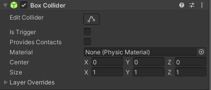
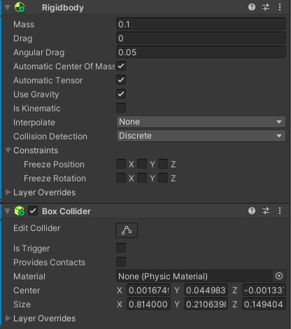

# Colisores-Unity

Cena com os tipos de colisores unity feito por Cauã Silva e Gabriel Faria 2ºJogos digitais

# Link da cena no drive
https://drive.google.com/file/d/18MtXQ4jPGHmprvNrobGoV9oFdt7cvNyu/view?usp=sharing

# Explicação da cena

A cena se passa em uma floresta a noite, onde um monstro persegue o personagem a todo momento. O personagem possui frutas que derrubam o monstro e possuem lugares na cena que são as safes zones(áreas onde o monstro não consegue atacar o personagem).

## Comandos
<ul>
    <li>W move para frente.</li>
    <li>S move para trás.</li>
    <li>A move para esquerda.</li>
    <li>D move para direita.</li>
    <li>Segurar shift junto com alguma tecla de movimento para correr.</li>
    <li>Espaço para pular.</li>
    <li>Mouse rotaciona a câmera.</li>
    <li>Botão esquerdo do mouse joga as frutas.</li>
</ul>

# Static collider

Um static collider é um GameObject que possui um Collider, mas não possui Rigidbody. Os static collider são usados principalmente para geometria de nível que sempre permanece no mesmo lugar e nunca se move.

Em nossa cena foram utilizados diversos statics colliders: No chão da cena, nas laterais invisiveis que ficam em volta do chão para o personagem não sair da cena(ao colidir com alguma dessas laterais o personagem sofre um efeito de recuo), nas árvores e pedras da floresta e na casa e suas decorações.

# RigidBody collider

Este é um GameObject com um Collider e um Rigidbody normal. Os RigidBody collider são totalmente simulados pelo mecanismo de física e podem reagir a colisões e forças aplicadas a partir de um script.

Em nossa cena o RigidBody collider foi utilizado no personagem, no monstro e nos troncos espalhados na floresta(podem ser empurrados pelo personagem e pelo monstro). Quando o monstro colide com o personagem, é ativado uma animação do monstro atacando.

# Kinematic RigidBody collider

É um Collider que está associado a um Rigidbody configurado como cinemático. Isso significa que o objeto não será afetado pelas forças físicas do ambiente, mas ainda pode ser usado para detecção de colisões ou interações controladas pelo código do jogo.

Em nossa cena ele foi utilizado na porta da casa que abre quando o persongem encosta nela e aperta a tecla "E".

# Static trigger collider

É um GameObject que possui um collider e não possui nenhuma física. Como ele está com um Trigger, será uma área sensível que não colide de maneira física, mas pode gerar eventos quando um objeto passa ou entra nela.

Em nossa cena ele foi utilizado em um gameObject invisivel com um box collider trigger, para ser uma área de safe zone dentro da casa, uma área que o monstro não pode entrar. Quando o jogador entra nessa área, um texto escrito "Safe Zone" aparece na tela e uma música começa a tocar.

# RigidBody trigger collider

É uma combinação de um Rigidbody e um Trigger. Isso significa que o objeto tem física associada e, ao mesmo tempo, pode ser configurado para atuar como uma área sensível a colisões para desencadear eventos quando outros objetos interagem com ele.

Em nossa cena ele foi utilizado na fruta que o personagem joga no monstro. Quando ela entra na área de colisão do monstro, ele fica com a velocidade igual à 0 e é ativado uma animação do monstro desmaiado durante 5 segundos. Ela é destruida quando entra na aréa de colisão das laterais e do chão. É possível jogar apenas 5 frutas, se acabar, mostrará uma mensagem dizendo "Acabou suas frutas!".

# Kinematic RigidBody trigger collider

É um objeto que pode ser movido programaticamente, mas não responde à física do ambiente, e que atua como uma área sensível a colisões para desencadear eventos quando outros objetos colidem com ele.

Ele foi utilizado em dois arbustos na floresta que também servem de safe zone, quando o personagem fica dentro dele, o monstro não consegue atacá-lo e o texto escrito "Safe Zone" aparece na tela e a música começa a tocar.

# Vídeo da execução do projeto
https://drive.google.com/file/d/1u3bP6wdm6GVIaCaVOZXs3eQ0IyhmRzj0/view?usp=sharing
